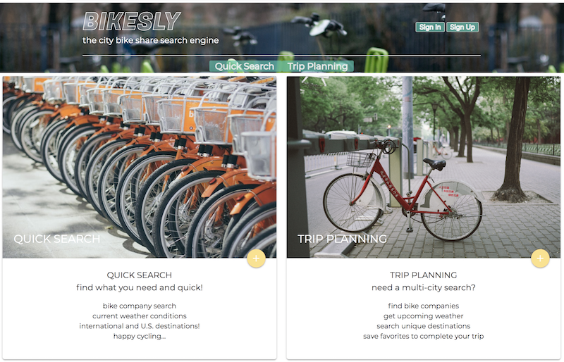

# BIKESLY  - - > 🚲
## the bike share search engine 

* Deployed Site: http://rafischer1-q1-bikesly.surge.sh/

* Trello: https://trello.com/b/rFj9C0yT/q1-planning-board

---

### Screen Shots

---
Q1 Project completed for G103 - Artie Fischer
https://github.com/rafischer1

---
If you are reading this far: thank you. Also, this project represents where I was in skill and challenge level in September 2018. I am constantly amazed at how far I have come in just a few very intense months and looking back on these projects reminds me that, with dedication, I can learn and contribute so much more. 
